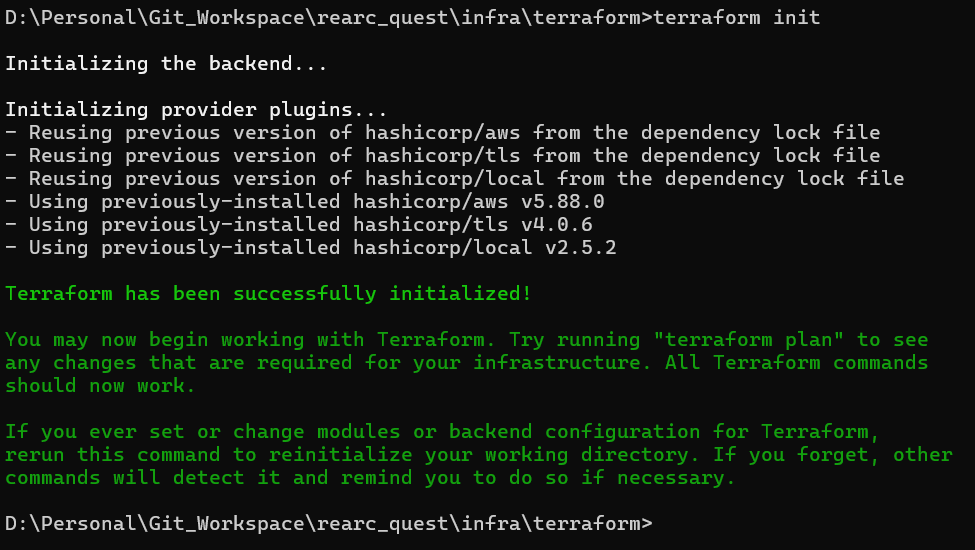
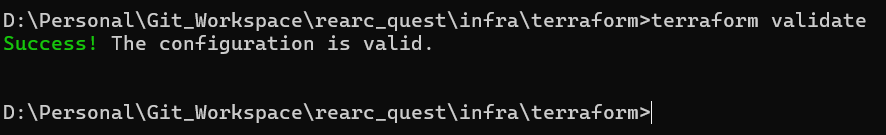
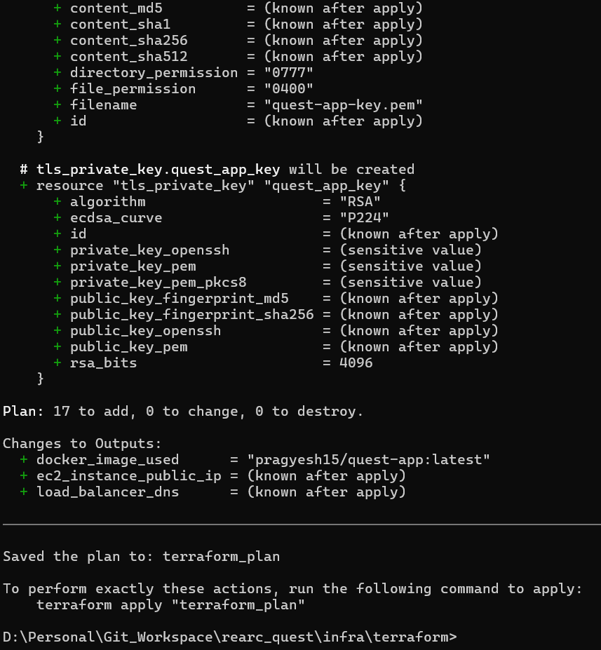
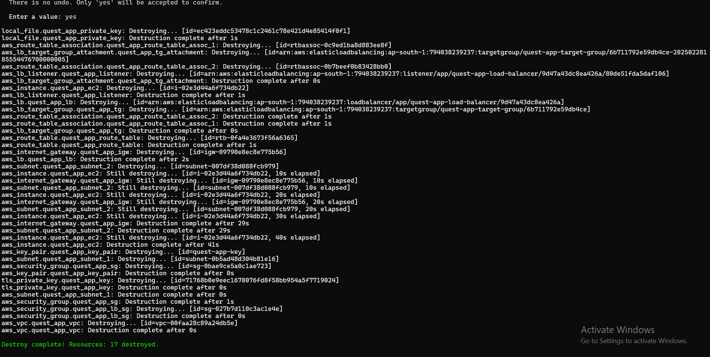
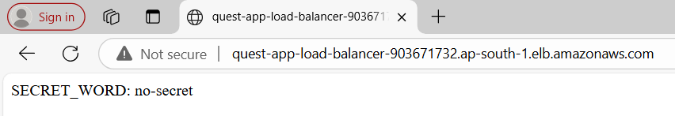
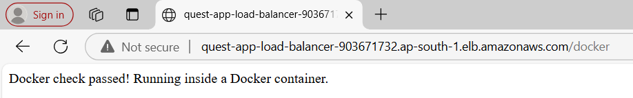
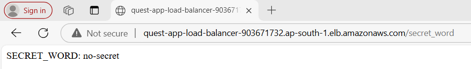
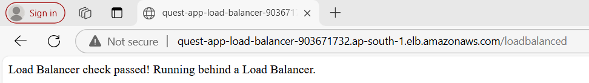
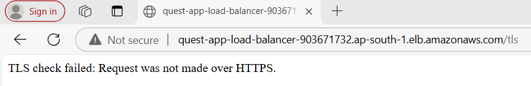

Problem Statement
=================

- Deploy the app in a container in any public cloud using the services you think best solve this problem.
- Use Node as the base image. Version node:10 or later should work.
- Navigate to the index page to obtain the SECRET_WORD.
- Inject an environment variable (SECRET_WORD) in the Docker container using the value on the index page.
- Deploy a load balancer in front of the app.
- Add TLS (https). You may use locally-generated certs.

Architecture
============

Technical Specification
-----------------------

 - **Cloud Provider** : AWS
 - **Infrastructure as code** : Terraform
 - **Containerization** : Docker
 - **Version Control** : Git
 - **Container Registry** : DockerHub

AWS Components
--------------

- **VPC**: A Virtual Private Cloud (VPC) with a CIDR block (e.g., 10.0.0.0/16).

- **Subnets**: Two public subnets (quest_app_subnet_1 and quest_app_subnet_2) in different Availability Zones (AZs).

- **Internet Gateway (IGW)**: Attached to the VPC to allow internet access.

- **Route Table**: A route table with a default route (0.0.0.0/0) pointing to the Internet Gateway. Associated with both subnets.

- **EC2 Instance**: A single EC2 instance (quest_app_ec2) launched in quest_app_subnet_1. Runs a Docker container with a Node.js application listening on port 80.

- **Application Load Balancer (ALB)**: An internet-facing ALB (quest_app_lb) spanning both subnets. Listens on port 80 (HTTP) and forwards traffic to the EC2 instance.

- **Target Group**: A target group (quest_app_tg) associated with the EC2 instance. Health checks are configured to ensure the instance is healthy.

- **Security Groups**:
    - **ALB Security Group**: Allows inbound HTTP (port 80) traffic from the internet. Allows all outbound traffic.
    - **EC2 Security Group**: Allows inbound HTTP (port 80) traffic from the ALB. Allows inbound SSH (port 22) traffic from the internet. Allows all outbound traffic.

Docker Commands
---------------
 - **Build**
    - Go to `rearc_quest/app` directory
    - `docker build -t quest-app .`
    - Check whether the image has been created locally by running `docker images | grep quest-app`
 - **Test Locally**
    - `docker run -d -p 80:80 --name quest-app quest-app`
    - Open a browser and try the following URLs:
        - `http://localhost/`
        - `http://localhost/secret_word`
        - `http://localhost/docker`
        - `http://localhost/loadbalanced`
        - `http://localhost/tls`
    - Make sure the above URLs are working fine with the desired output before moving to the next step.
 - **Tag & Push Image to DockerHub**
    - Login to DockerHub by running `docker login`
    - `docker tag quest-app:latest <docker_registry>/quest-app:latest`
    - `docker push <docker_registry>/quest-app:latest`

Terraform Execution
-------------------
Prerequisites:
- **Terraform Installed**: Ensure that Terraform is installed on your local machine. You can download it from the [official Terraform website](https://www.terraform.io/downloads.html).
- **AWS CLI Installed**: Install the AWS Command Line Interface (CLI) to interact with AWS services. You can download it from the [official AWS CLI website](https://aws.amazon.com/cli/).
- **AWS Credentials Configured**: Configure your AWS credentials by running `aws configure` and providing your AWS Access Key ID, Secret Access Key, region, and output format.
- **Git Installed**: Ensure Git is installed on your local machine to manage your version control. You can download it from the [official Git website](https://git-scm.com/downloads).
- **Terraform User Created**: Create an IAM user named `terraform-user` with the required policies.

Creating `terraform-user`:
1. Open the AWS Management Console.
2. Navigate to the IAM service.
3. Click on "Users" and then "Add user".
4. Enter `terraform-user` as the username.
5. Select "Programmatic access" for access type.
6. Click "Next: Permissions".
7. Attach the following policies:
    - `AmazonEC2FullAccess`
    - `AmazonS3FullAccess`
    - `AmazonVPCFullAccess`
    - `IAMFullAccess`
    - `AdministratorAccess`
8. Click "Next: Tags" (optional) and then "Next: Review".
9. Click "Create user".
10. Save the Access Key ID and Secret Access Key for configuring AWS CLI.

Execution Steps
---------------
- Go to `rearc_quest/infra/terraform` directory in command line.
- Run `terraform init` to initialize.

- Run `terraform validate` to validate the script.

- Run `terraform plan` to check what is going to update.

- Run `terraform apply` to apply changes to AWS.

- Run `terraform destroy` to destroy resources once testing is done.

Proof Of Completion
===================
Currently, I've destroyed the AWS infrastructure due to cost, but if you follow the steps above, all URLs will be accessible. I am attaching screenshots for each task below: 
1. **Public cloud & index page** (contains the secret word) - http://quest-app-load-balancer-903671732.ap-south-1.elb.amazonaws.com/ 

2. **Docker check** - http://quest-app-load-balancer-903671732.ap-south-1.elb.amazonaws.com/docker

3. **Secret Word check** - http://quest-app-load-balancer-903671732.ap-south-1.elb.amazonaws.com/secret_word

4. **Load Balancer check** - http://quest-app-load-balancer-903671732.ap-south-1.elb.amazonaws.com/loadbalanced

5. **TLS check** - http://quest-app-load-balancer-903671732.ap-south-1.elb.amazonaws.com/tls

Given more time, I would improve
================================
- **Fix for TLS**
    - I would have added TLS using Terraform, but the DNS is dynamically generated.
    - The domain name `quest-app-load-balancer-*.ap-south-1.elb.amazonaws.com` is not valid for a certificate.
    - Certificates cannot be issued for dynamically generated domain names like `*.elb.amazonaws.com`.
    - This can be achieved by creating the Load Balancer through Terraform and then manually attaching local certificates to the generated DNS and updating the ALB listener.
- **Use of Kubernetes and EKS**
    - For this project, I opted not to use Kubernetes due to its complexity and cost for a single application with one instance.
    - However, using Kubernetes could provide a more scalable and highly available solution.
    - In a larger-scale deployment, Kubernetes would be a better choice for managing containerized applications efficiently.
- **Deployment Pipeline**
    - Setting up a CI/CD pipeline can greatly enhance the process of building, testing, and deploying the application seamlessly.
- **Demo Video**
    - I would have loved to create a video explaining the full solution.

Points Worth Mentioning
========================
- I utilized ChatGPT to assist with completing the assignment where applicable.
- Initially, it appeared to be a chicken-and-egg problem: needing the SECRET_WORD from the app to inject it back into the app.
- Based on my understanding, I have addressed the assignment requirements. However, if the expectations are not fully met, I am open to revisiting and refining the solution.

